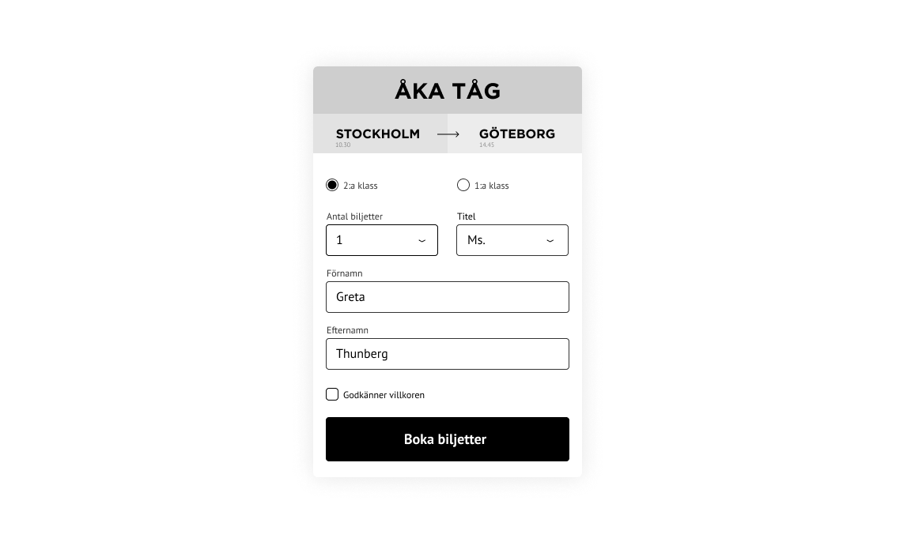
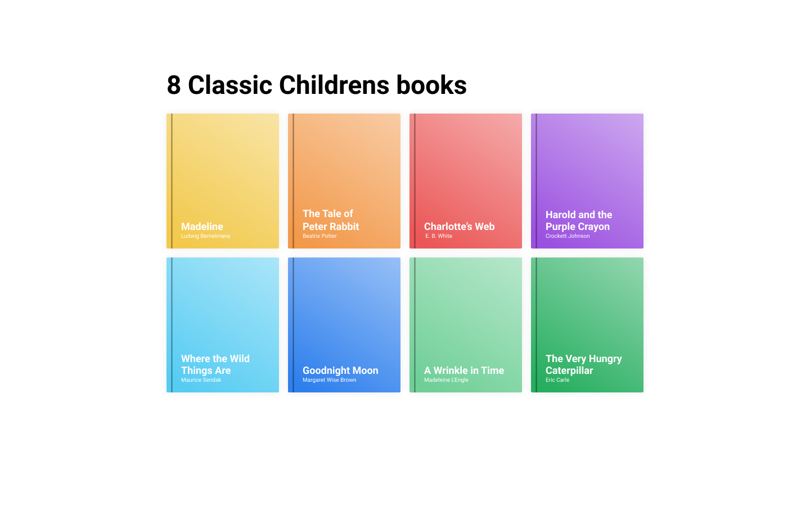

# Svelte bootcamp
Övningar för Svelte ramverket.

## 1. Component
**1.1**  
### Grace Hopper
**teknik:** *local props - one way bindning*
I denna övning ska du göra en enkel sida om [Grace Hopper](https://sv.wikipedia.org/wiki/Grace_Hopper). Datan ska _inte_ hårdkodas i html utan hämtas ifrån ```local props``` i state.

```js
const grace = {
    title: 'Grace Hopper',
    img: 'https://upload.wikimedia.org/wikipedia/commons/5/55/Grace_Hopper.jpg',
    subTitle: 'Coolaste kodaren i marinen',
    content: 'Grace Hopper var en amerikansk dator-pionjär och sjöofficer (flottiljamiral). Hon var bland annat med och utvecklade Harvard Mark I och skapade den första kompilatorn. Hon populariserade användningen av programmeringsspråk som var oberoende av maskinen, något som ledde till utvecklingen av COBOL, ett högnivå programmeringsspråk som fortfarande används idag.'
}
```


### 2. Dynamic attributs
**Teknik** *Input till uppercase*
**2.1** Skriv ett program som tar ett inputfält och skriver ut innehållet i en ```<h1>``` med versaler(stora bokstäver).

## 3. Events
**3.1** Skapa en knapp och lyssna efter ett click-event. När klick-eventet registeras så ska en alert köras.

```
alert('Ariba!');
```

## 4. Loopar & Listor

**Teknik:** Loopar i Svelte

```js
const fruits = ['äpple', 'banan', 'kiwi', 'ananas', 'apelsin', 'clementin'];
```

**4.1** Loopa ut ovanstående array i en ```<ul>```.

**4.2** Loopa ut samma array, men sätt positionen framför. 

Ex. 

```
0. äpple
1. banan
```

**4.3** Loop da loop

```js
const persons = [
    {
        name: 'Sixten',
        likes: [
            'flowers',
            'biking',
            'music'
        ]
    },
    {
        name: 'Viola',
        likes: [
            'HTML',
            'CSS',
            'JS'
        ]
    }, 
    {
        name: 'Jean',
        likes: [
            'food',
            'movies',
            'dogs'
        ]
    }
];
```

Loopa ut ovanstående personer och deras intressen. Förslag på struktur är:

```html
<article>
    <ul>
        <li>
```

**4.4** Loopa ut fruktlistan i en komponent ```Fruit.svelte``` istället. Tänk på du måste skicka ner frukten som en ```props```.

```
App.svelte -- props --> Fruit.svelte
```

**4.5** Fruktsallad

|Frukter|Sallad|
|---|---|
| Banan
Kiwi
Päron
Äpple
Ananas
Melon
Papaya | |

**Steg 1** Skapa *två arrayer*, en fylld med minst 5 frukter, den andra tom.
När man klickar på en frukt så ska frukten kopieras in i den tomma arrayen. Du ska så att säga *“klicka ihop din fruktsallad”*.
Den från början tomma arrayen får fyllas med hur många kopior av frukter som helst.

**Steg 2** Istället för att kopiera över frukter så ska du nu flytta frukter. D.v.s. tar du päron från frukt-arrayen ska päron “flyttas” till nya.

**Level up**
Kopiera in frukter i ny tom array, dock ska det istället för flera päron ska det stå antal, ex. har du klickat på päron 3 ggr på frukt-arrayen ska det i nya stå “3 st päron”.

*Hint:* Du kanske måste göra om datastrukturen?


## 5. Logik
**teknik:** if / if-else

**5.1** Lisebergsvakten
Gör en funktion som ska sitta i en sensor på lisebergs åkattration Helix. För att få åka helix ska man vara minst 150cm lång. Gör ett litet formulär som består av ett inputfält ( cm ) och en knapp ( let me ride! ) 

Om godkänd lägd har skrivits in så skall "Wheeee!!" visas ovanför formuläret. Annars "No Helix for you!".

**5.2** Lisebergsvakten 2.0
På Liseberg finns 4 olika åkband; *small*, *medium*, *large* och *platinum*.
För att få åka Balder krävs ```large``` och ```platinum```.

Gör ett fomulär där användaren får ange vilket åkpass de har. 
Om godkända pass har angetts så skall *"Wheeee!!"* visas ovanför formuläret. Annars *"No Balder for you!"*.


**5.3** Good vs Evil

```js
let transformers = [
  { name: 'Megatron', evil: true },
  { name: 'Shockwave', evil: true },
  { name: 'Thunderwing', evil: true },
  { name: 'Starscream', evil: true },
  { name: 'Galvatron', evil: true },
  { name: 'Optimus Prime', evil: false },
  { name: 'Bumblebee', evil: false },
  { name: 'Jazz', evil: false },
  { name: 'Ironhide', evil: false },
  { name: 'Mirage', evil: false },
]
```

Loopa ut ovanstående array. I listan som loopas ut ska det efter varje transformer klasgöras om den är ond eller god. Guldstjärna om du även gör så de får olika färger ( good = grön, evil = red).

ex.

```
Megatron (evil)
Optimus Prime (good)
```

## 6. Miniprojekt
### 6.1 Booking form
**teknik:** *Local props & two-way binding*
I denna uppgift ska du göra ett enklare formulär där inputfälten synkas med ett lokalt object ```formData```.
Vid tryck på knappen så ska ett ifyllt objekt ```console.log:as```.

**Level up**
- Om man inte klickat i gdpr-godkännandet ska man inte kunna trycka på knappen.

```js
let formData = {
    class: 1, // första / andra klass
    tickets: 1, // antal biljetter
    firstName: '', // Förnamn
    lastName: '', // Efternamn
    gdpr: false
};
```



### 6.2 Childrens books

Använd [följande bok-data](https://gist.github.com/zocom-johan-kivi/5ee020c77c5e2b86b4eac7f181128055) och bygg en liten webbapp som visar samtliga böcker. Vid klick på någon av böckerna så skall mer info om den boken visas. 




### Shopping cart